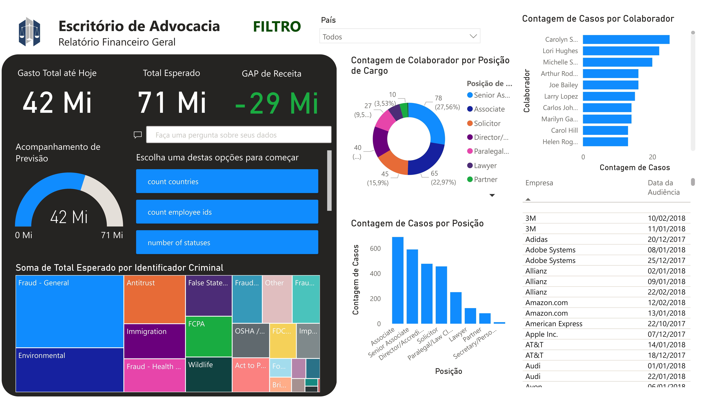
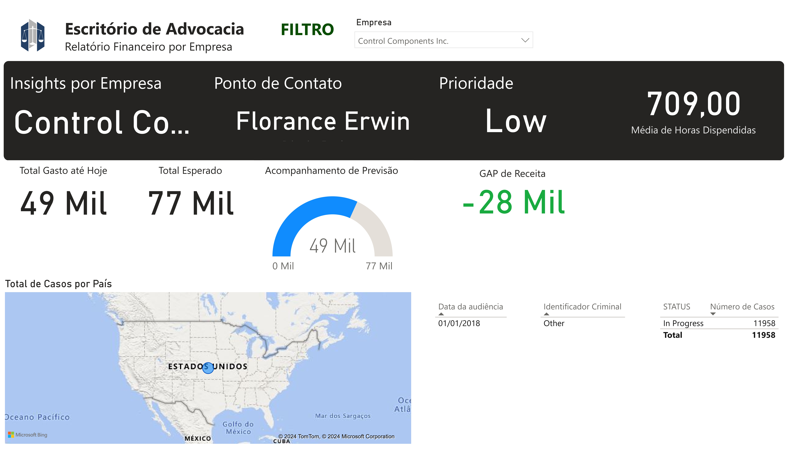

# Relatório Financeiro em Power BI para Escritório de Advocacia

Este projeto consiste em um relatório financeiro interativo desenvolvido no Power BI, com o objetivo de fornecer insights financeiros e operacionais para a gestão de um escritório de advocacia. Através de uma análise detalhada de dados, o relatório facilita a tomada de decisões estratégicas ao apresentar métricas-chave e tendências que impactam diretamente a rentabilidade e a eficiência do negócio.

## Objetivos

O relatório tem como foco principal:

- Monitoramento do fluxo de caixa, receitas e despesas operacionais.
- Análise da rentabilidade por cliente e por tipo de caso (identificador criminal).
- Identificação de tendências de produtividade por colaborador.
- Controle de gastos e análise de contas.
- Comparação de resultados com metas financeiras pré-estabelecidas.

## Ferramentas Utilizadas

- **Power BI**: Ferramenta de visualização de dados para construção de dashboards e relatórios interativos.
- **Excel** (ou outro software de planilha): Para manipulação prévia de dados, quando necessário.
- **Fontes de Dados**: Base de dados financeira, registros de clientes e relatórios de desempenho internos.

## Estrutura do Relatório

O relatório foi organizado em diferentes páginas que abordam aspectos financeiros e operacionais críticos para o escritório, tais como:

1. **Visão Geral Financeira**: Apresenta os principais KPIs financeiros, como gasto total até o momento, projeção de gasto total esperado e margem disponível.
2. **Análise de Clientes**: Detalhamento da rentabilidade por cliente, volume de casos por cliente e segmentação de inadimplência.
3. **Performance de Advogados**: Métricas de produtividade por advogado, despesas e análise de alocação de tempo.

## Screenshots

### Visão Geral do Escritório de Advocacia


### Visão de Clientes do Escritório de Advocacia


## Como Executar este Projeto

1. Clone este repositório:
   ```bash
   git clone https://github.com/pedrolporto/law-firm-report.git
Abra o arquivo .pbix no Power BI Desktop para visualizar o relatório e, se necessário, ajustar as conexões de dados.

(Opcional) Carregue novas bases de dados conforme a necessidade da sua análise.

Requisitos para Execução
Power BI Desktop (última versão recomendada)
Acesso às bases de dados financeiras do escritório de advocacia (dados fictícios ou anonimizados podem ser usados para teste)

## Autor

- [@pedrolporto](https://www.github.com/pedrolporto)

## Dados

- Dados fornecidos pela DataTechFlorida.
